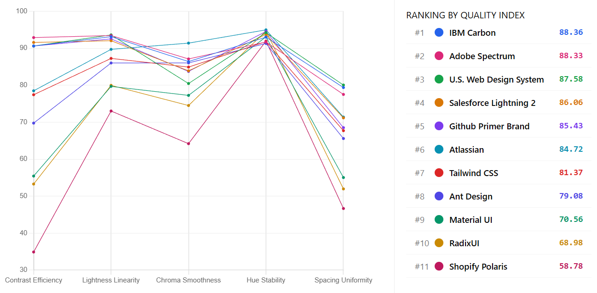
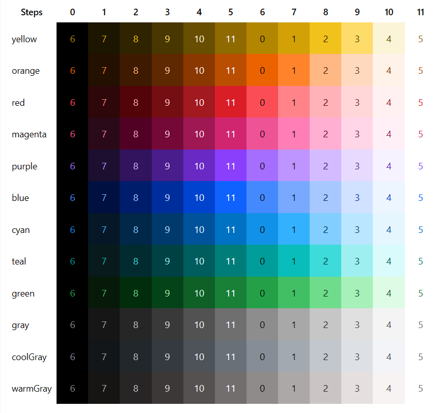
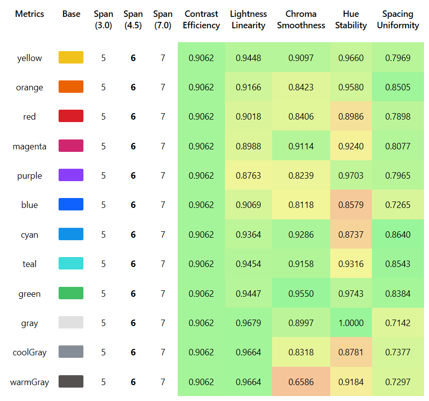
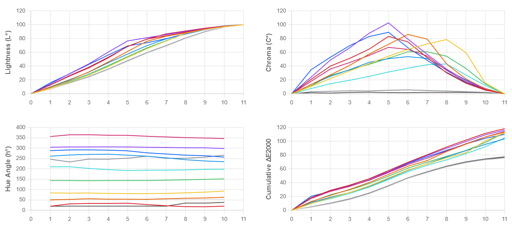

# Chromametry
> A metrics framework for evaluating web-accessible sequential color palettes.



*Figure 1. Web-accessible Palette Ranking*

## Metric Definitions

1.  **Contrast Efficiency:** Measures how efficiently contrast space is used to achieve WCAG 4.5:1 contrast.
2.  **Lightness Linearity:** Evaluates the linearity of lightness (with Helmholtz–Kohlrausch correction).
3.  **Chroma Smoothness:** Checks for artifacts and kinks in the saturation curve using Monotone Cubic Splines.
4.  **Hue Stability:** Quantifies hue shift/drift across the lightness ramp.
5.  **Spacing Uniformity:** Measures the consistency of color spacing (DeltaE 2000).  
>[Read full Methodology](https://github.com/chromametry/chromametry.git)

> All lightness, chroma, hue, and DeltaE2000 computations are performed in the CIELAB color space.
    
## Benchmark Rankings

Comparison of popular design systems based on Chromametry metrics.

| Rank  | Design System              | Steps | Span (K) | Contrast Efficiency | Lightness Linearity | Chroma Smoothness | Hue Stability | Spacing Uniformity | **SCORE** |
| :---: | :------------------------- | :---: | :--------: | :-----------------: | :-----------------: | :---------------: | :-----------: | :----------------: | :-------: |
|   🥇   | **IBM Carbon**             |  12   |     6      |        0.906        |        0.932        |       0.864       |     0.930     |       0.794        | **88.36** |
|   🥈   | **Adobe Spectrum**         |  18   |     9      |        0.929        |        0.935        |       0.871       |     0.917     |       0.775        | **88.33** |
|   🥉   | **U.S. Web Design System** |  12   |     6      |        0.906        |        0.936        |       0.805       |     0.942     |       0.801        | **87.58** |
|   4   | Salesforce Lightning 2     |  14   |     7      |        0.916        |        0.921        |       0.839       |     0.938     |       0.712        | **86.06** |
|   5   | GitHub Primer Brand        |  12   |     6      |        0.906        |        0.926        |       0.838       |     0.946     |       0.685        | **85.43** |
|   6   | Atlassian                  |  14   |     8      |        0.785        |        0.897        |       0.914       |     0.950     |       0.714        | **84.72** |
|   7   | Tailwind CSS               |  13   |     8      |        0.774        |        0.873        |       0.849       |     0.918     |       0.677        | **81.37** |
|   8   | Ant Design                 |  12   |     9      |        0.698        |        0.860        |       0.861       |     0.913     |       0.656        | **79.08** |
|   9   | Material UI                |  12   |     11     |        0.554        |        0.797        |       0.773       |     0.931     |       0.550        | **70.56** |
|  10   | Radix UI                   |  13   |     10     |        0.533        |        0.800        |       0.745       |     0.947     |       0.520        | **68.98** |
|  11   | Shopify Polaris            |  17   |     15     |        0.349        |        0.730        |       0.642       |     0.920     |       0.467        | **58.78** |

*Table 1. Benchmark ranking of design systems evaluated using Chromametry metrics.*

> **Note:** Design systems like Bootstrap,Google Material 3, Apple Human Interface or Fluent UI are excluded as they define discrete semantic tokens rather than algorithmic sequential ramps.

> **Overall Score** is computed as the weighted mean of the five normalized metrics, using equal weights by default.

### Example: A Typical Report


*Figure 2. IBM Carbon Color Palette.*


*Figure 3. IBM Carbon Palette Metrics.*



*Figure 4. IBM Carbon Palette Charts.*

## Benchmark result page

- Online Report : [Benchmark page](https://github.com/chromametry/benchmarks/monochromatic)
- Local `/benchmarks/monochromatic/output/index.html` (double click)

## Analyze Palettes
### Installation
**NPM Package:**
```bash
npm install chromametry
```
**CDN (Browser) ESM:**
```js
<script type="module">
  import { analyzeMonochromaticPalette } from 'https://esm.sh/chromametry';
</script>
  const result = Chromametry.analyzeMonochromaticPalette({ ... });
</script>

```

**CDN (Browser) Global:**
```js
<script src="https://unpkg.com/chromametry/dist/index.global.js"></script>
<script>
  const result = Chromametry.analyzeMonochromaticPalette({ ... });
</script>
```

### Usage
```ts
import { analyzeMonochromaticPalette } from 'chromametry';

// 1. Define your colors (must include white/black anchors for accurate scoring)
const colors = {
  yellow: ["#ffffff","#fcf4d6","#fddc69","#f1c21b","#d2a106","#b28600","#8e6a00","#684e00","#483700","#302400","#1c1500","#000000"],
  orange: ["#ffffff","#fff2e8","#ffd9be","#ffb784","#ff832b","#eb6200","#ba4e00","#8a3800","#5e2900","#3e1a00","#231000","#000000"]
};

// 2. Define step names corresponding to the array length
const stepNames = [0, 100, 200, 300, 400, 500, 600, 700, 800, 900, 950,1000];

// 3. Run analysis
const result = analyzeMonochromaticPalette({
    name: "My Custom Brand",
    stepNames: stepNames,
    colors: colors
});

console.log(result.metrics); 
console.log(`System Score: ${result.score}`);
```

## Reproducing Benchmarks
To run the benchmark generator locally:
```bash
git clone https://github.com/chromametry/chromametry.git
cd chromametry
npm install
npm run generate
```

## Adding Custom Palettes to Benchmark
Create a new .ts file in benchmarks/monochromatic/input/ (e.g., my-palette.ts).

```ts
import { MonochromaticPaletteData } from "../../../src/index.js";
import { red, volcano, gold } from '@ant-design/colors';

// Define colors (imported or inline object)
let colors: Record<string, string[]> = { red, volcano, gold };

// Ensure white/black anchors exist if your ramp misses them
for (let name in colors) {
    if (colors[name][0] !== "#ffffff") colors[name].unshift("#ffffff");
    if (colors[name][colors[name].length - 1] !== "#000000") colors[name].push("#000000");
}

const stepNames = Object.keys(Object.values(colors)[0]);

const palette: MonochromaticPaletteData = {
    name: "Ant Design",
    stepNames, // string[]
    colors     // Record<string, string[]> 
};

export default palette;
```
Then regenerate the report:
```bash
npm run generate
```

### Input Requirements
- Equal Steps: All color ramps must have the same number of steps.

- Format: Colors must be Hex strings.

- Monotonicity: Lightness must strictly increase or decrease (sorted).

- Anchors: Start/End colors should ideally be Black and White.

