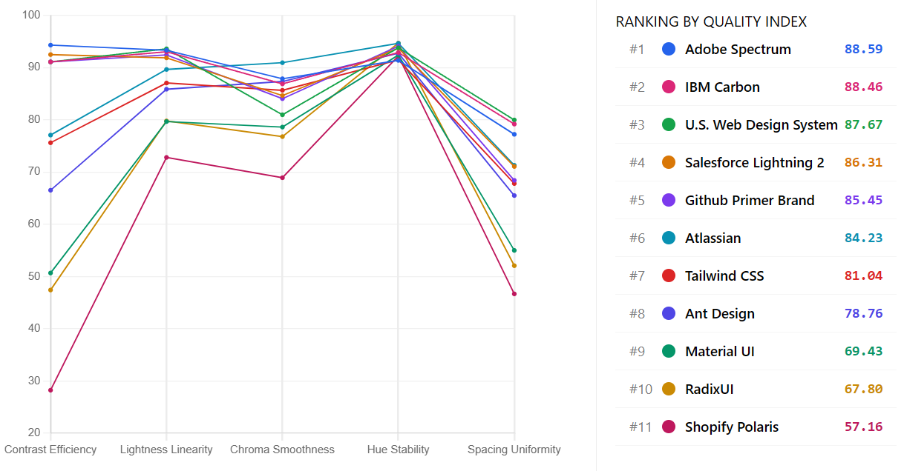
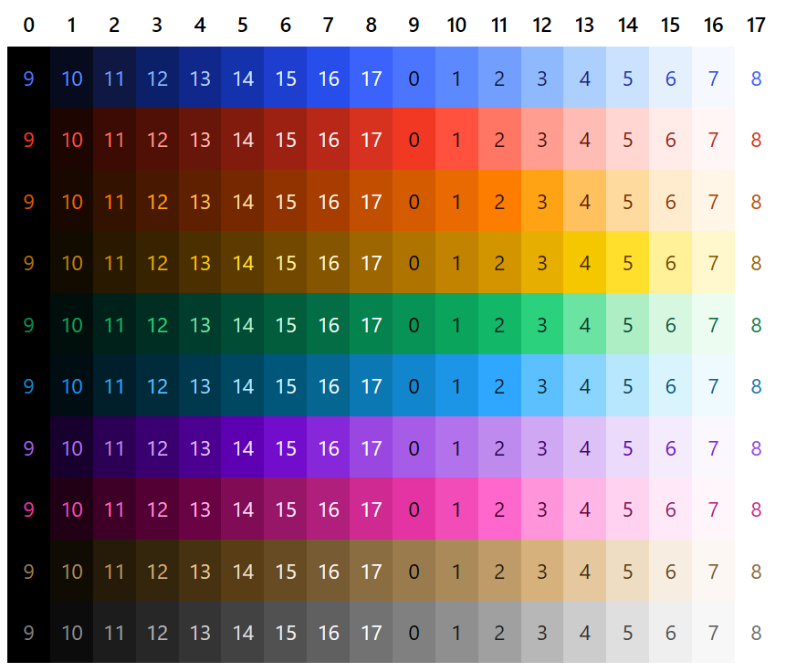
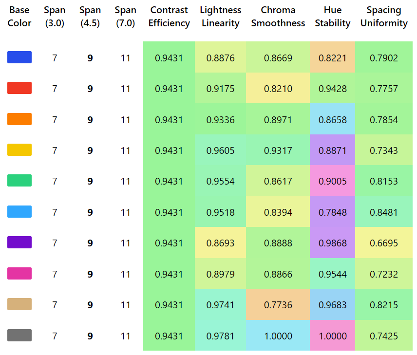
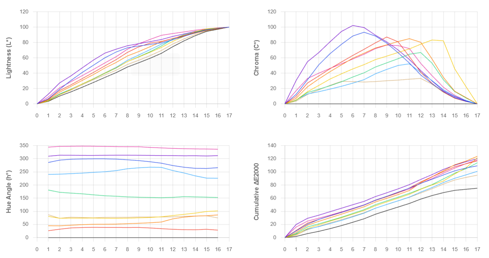

# Chromametry
> A metrics framework for evaluating web-accessible sequential color palettes.



*Figure 1. Web-accessible Palette Ranking*

## Metric Definitions

1.  **Contrast Efficiency:** Measures how efficiently contrast space is used to achieve WCAG 4.5:1 contrast.
2.  **Lightness Linearity:** Evaluates the linearity of lightness (with Helmholtz–Kohlrausch correction).
3.  **Chroma Smoothness:** Checks for artifacts and kinks in the saturation curve using Monotone Cubic Splines.
4.  **Hue Stability:** Quantifies hue shift/drift across the lightness ramp.
5.  **Spacing Uniformity:** Measures the consistency of color spacing (DeltaE 2000).  


>[Read full paper](paper/paper.pdf)

> All lightness, chroma, hue, and DeltaE2000 computations are performed in the CIELAB color space.
    
## Benchmark Rankings

Comparison of popular design systems based on Chromametry metrics.

| Rank | Color Palette              | Ramp Count | Steps | Span (K) | Contrast Efficiency | Lightness Linearity | Chroma Smoothness | Hue Stability | Spacing Uniformity | **SCORE** |
| :--: | :------------------------- | :--------: | :---: | :------: | :-----------------: | :-----------------: | :---------------: | :-----------: | :----------------: | :-------: |
| 1 | Adobe Spectrum        | 10 | 18 | 9  | 0.947 | 0.9333 | 0.8786 | 0.9138 | 0.7722 | **88.67** |
| 2 | IBM Carbon             | 12 | 12 | 6  | 0.923 | 0.9303 | 0.8688 | 0.9252 | 0.7919 | **88.62** |
| 3 | U.S. Web Design System | 25 | 12 | 6  | 0.923 | 0.9359 | 0.8096 | 0.9380 | 0.7997 | **87.90** |
| 4 | Salesforce Lightning 2     | 13 | 14 | 7  | 0.933 | 0.9187 | 0.8464 | 0.9372 | 0.7107 | **86.47** |
| 5 | GitHub Primer Brand        | 13 | 12 | 6  | 0.923 | 0.9243 | 0.8405 | 0.9408 | 0.6841 | **85.67** |
| 6 | Atlassian                  | 9  | 14 | 8  | 0.800 | 0.8964 | 0.9094 | 0.9465 | 0.7129 | **84.86** |
| 7 | Tailwind CSS               | 18 | 13 | 8  | 0.789 | 0.8705 | 0.8565 | 0.9147 | 0.6780 | **81.74** |
| 8 | Ant Design                 | 12 | 12 | 9  | 0.711 | 0.8586 | 0.8734 | 0.9276 | 0.6550 | **79.81** |
| 9 | Material UI                | 19 | 12 | 11 | 0.565 | 0.7967 | 0.7861 | 0.9239 | 0.5500 | **70.95** |
| 10 | Radix UI                  | 16 | 13 | 10 | 0.543 | 0.7979 | 0.7679 | 0.9481 | 0.5207 | **69.67** |
| 11 | Shopify Polaris            | 12 | 17 | 15 | 0.356 | 0.7281 | 0.6892 | 0.9223 | 0.4667 | **59.86** |


*Table 1. Benchmark ranking of design systems evaluated using Chromametry metrics.*

> **Note:** Design systems like Bootstrap,Google Material 3, Apple Human Interface or Fluent UI are excluded as they define discrete semantic tokens rather than algorithmic sequential ramps.

> **Overall Score** is computed as the weighted mean of the five normalized metrics, using equal weights by default.

### Example: A Typical Report


*Figure 2. Adobe Spectrum Color Palette.*


*Figure 3. Adobe Spectrum Palette Metrics.*


*Figure 4. Adobe Spectrum Palette Charts.*

## Benchmark result page

- Online Report : [Benchmark page](https://chromametry.github.io/chromametry/benchmarks/monochromatic/)
- Local `/benchmarks/monochromatic/output/index.html` (double click)

## Analyze Palettes
### Installation
**NPM Package:**
```bash
npm install chromametry
```
**CDN (Browser) ESM:**
```js
<script type="module">
  import { analyzeMonochromaticPalette } from 'https://esm.sh/chromametry';
</script>
  const result = Chromametry.analyzeMonochromaticPalette({ ... });
</script>

```

**CDN (Browser) Global:**
```js
<script src="https://unpkg.com/chromametry/dist/index.global.js"></script>
<script>
  const result = Chromametry.analyzeMonochromaticPalette({ ... });
</script>
```

### Usage
```ts
import { analyzeMonochromaticPalette } from 'chromametry';

// 1. Define your colors (must include white/black anchors for accurate scoring)
const colors = {
  yellow: ["#ffffff","#fcf4d6","#fddc69","#f1c21b","#d2a106","#b28600","#8e6a00","#684e00","#483700","#302400","#1c1500","#000000"],
  orange: ["#ffffff","#fff2e8","#ffd9be","#ffb784","#ff832b","#eb6200","#ba4e00","#8a3800","#5e2900","#3e1a00","#231000","#000000"]
};

// 2. Define step names corresponding to the array length
const stepNames = [0, 100, 200, 300, 400, 500, 600, 700, 800, 900, 950,1000];

// 3. Run analysis
const result = analyzeMonochromaticPalette({
    name: "My Custom Brand",
    stepNames: stepNames,
    colors: colors
});

console.log(result.metrics); 
console.log(`System Score: ${result.score}`);
```

## Reproducing Benchmarks
To run the benchmark generator locally:
```bash
git clone https://github.com/chromametry/chromametry.git
cd chromametry
npm install
npm run generate
```

## Adding Custom Palettes to Benchmark
Create a new .ts file in benchmarks/monochromatic/input/ (e.g., my-palette.ts).

```ts
import { MonochromaticPaletteData } from "../../../src/index.js";
import { red, volcano, gold } from '@ant-design/colors';

// Define colors (imported or inline object)
let colors: Record<string, string[]> = { red, volcano, gold };

// Ensure white/black anchors exist if your ramp misses them
for (let name in colors) {
    if (colors[name][0] !== "#ffffff") colors[name].unshift("#ffffff");
    if (colors[name][colors[name].length - 1] !== "#000000") colors[name].push("#000000");
}

const stepNames = Object.keys(Object.values(colors)[0]);

const palette: MonochromaticPaletteData = {
    name: "Ant Design",
    stepNames, // string[]
    colors     // Record<string, string[]> 
};

export default palette;
```
Then regenerate the report:
```bash
npm run generate
```

### Input Requirements
- Equal Steps: All color ramps must have the same number of steps.

- Format: Colors must be Hex strings.

- Monotonicity: Lightness must strictly increase or decrease (sorted).

- Anchors: Start/End colors should ideally be Black and White.

