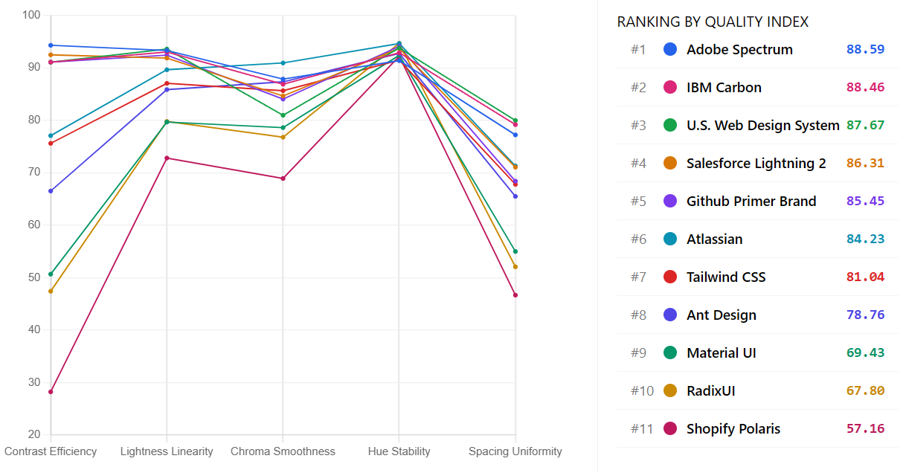
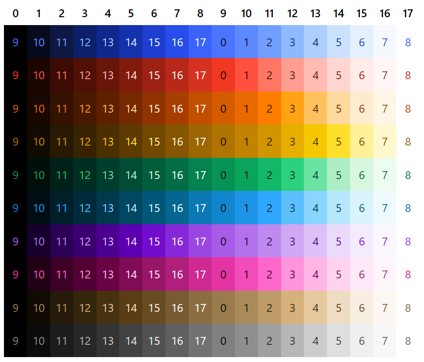
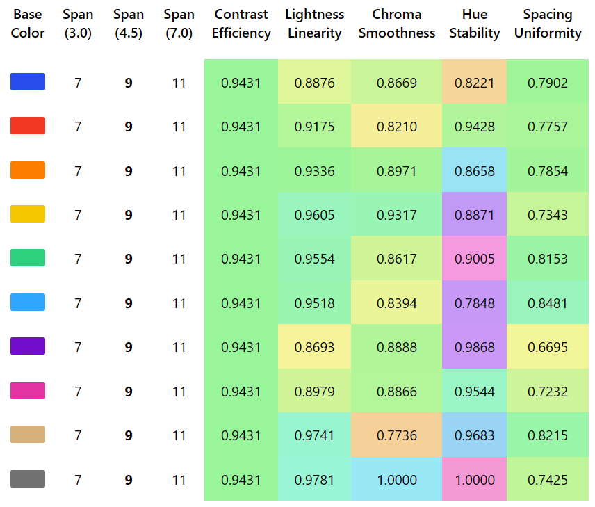
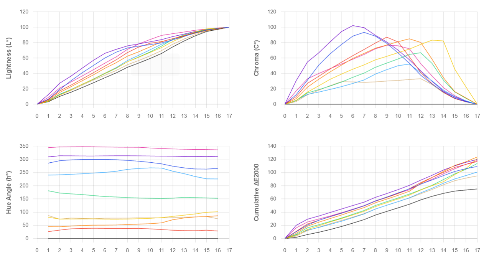

# Chromametry
> A metrics framework for evaluating web-accessible sequential color palettes.



*Figure 1. Web-accessible Palette Ranking*

## Metric Definitions

1.  **Contrast Efficiency:** Measures how efficiently contrast space is used to achieve WCAG 4.5:1 contrast.
2.  **Lightness Linearity:** Evaluates the linearity of lightness (with Helmholtz–Kohlrausch correction).
3.  **Chroma Smoothness:** Checks for artifacts and kinks in the saturation curve using Monotone Cubic Splines.
4.  **Hue Stability:** Quantifies hue shift/drift across the lightness ramp.
5.  **Spacing Uniformity:** Measures the consistency of color spacing (DeltaE 2000).  


>[Read full paper](paper/paper.pdf)

> All lightness, chroma, hue, and DeltaE2000 computations are performed in the CIELAB color space.
    
## Benchmark Rankings

Comparison of popular design systems based on Chromametry metrics.
| Design System          | Steps | Span (K) | Contrast Efficiency | Lightness Linearity | Chroma Smoothness | Hue Stability | Spacing Uniformity | **SCORE** |
| :--------------------- | :---: | :------: | :-----------------: | :-----------------: | :---------------: | :-----------: | :----------------: | :-------: |
| Adobe Spectrum         |   18  |     9    |        0.9431       |        0.9333       |       0.8786      |     0.9138    |       0.7722       | **88.59** |
| IBM Carbon             |   12  |     6    |        0.9109       |        0.9303       |       0.8688      |     0.9288    |       0.7919       | **88.46** |
| U.S. Web Design System |   12  |     6    |        0.9109       |        0.9359       |       0.8096      |     0.9380    |       0.7997       | **87.67** |
| Salesforce Lightning 2 |   14  |     7    |        0.9249       |        0.9187       |       0.8464      |     0.9372    |       0.7107       | **86.31** |
| GitHub Primer Brand    |   12  |     6    |        0.9109       |        0.9243       |       0.8405      |     0.9408    |       0.6841       | **85.45** |
| Atlassian              |   14  |     8    |        0.7708       |        0.8964       |       0.9094      |     0.9465    |       0.7129       | **84.23** |
| Tailwind CSS           |   13  |     8    |        0.7561       |        0.8705       |       0.8565      |     0.9147    |       0.6780       | **81.04** |
| Ant Design             |   12  |     9    |        0.6652       |        0.8586       |       0.8734      |     0.9276    |       0.6550       | **78.76** |
| Material UI            |   12  |    11    |        0.5067       |        0.7967       |       0.7861      |     0.9239    |       0.5500       | **69.43** |
| Radix UI               |   13  |    10    |        0.4742       |        0.7979       |       0.7679      |     0.9468    |       0.5207       | **67.80** |
| Shopify Polaris        |   17  |    15    |        0.2824       |        0.7281       |       0.6892      |     0.9223    |       0.4667       | **57.16** |


*Table 1. Benchmark ranking of design systems evaluated using Chromametry metrics.*

> **Note:** Design systems like Bootstrap,Google Material 3, Apple Human Interface or Fluent UI are excluded as they define discrete semantic tokens rather than algorithmic sequential ramps.

> **Overall Score** is computed as the geometric mean of the five normalized metrics.

### Example: A Typical Report


*Figure 2. Adobe Spectrum Color Palette.*


*Figure 3. Adobe Spectrum Palette Metrics.*


*Figure 4. Adobe Spectrum Palette Charts.*

## Benchmark result page

- Online Report : [Benchmark page](https://chromametry.github.io/chromametry/benchmark/)
- Local `/benchmark/index.html` (double click)

## API
### Installation
```bash
npm install chromametry
```

### Usage
```ts
import { Palette, Ramp, Swatch } from "chromametry";

const blue = new Ramp([
  "#ffffff",
  "#eff6fb",
  "#d9e8f6",
  "#aacdec",
  "#73b3e7",
  "#4f97d1",
  "#2378c3",
  "#2c608a",
  "#274863",
  "#1f303e",
  "#11181d",
  "#000000",
], "blue");

console.log(blue.baseColor);
console.log(blue.wcag[45].span);
console.log(blue.metrics);
console.log(blue.score);
console.log(blue.direction);

const palette = new Palette({
  blue: blue.colors,
  gray: ["#ffffff", "#dfe1e2", "#71767a", "#000000"],
}, "example");

console.log(palette.contrastEfficiency);
console.log(palette.lightnessLinearity);
console.log(palette.score);

const swatch = new Swatch("#2378c3");
console.log(swatch.lab);
console.log(swatch.chroma);
```

### Browser
**ESM**
```html
<script type="module">
  import { Ramp } from "https://esm.sh/chromametry";

  const ramp = new Ramp(["#ffffff", "#2378c3", "#000000"], "blue");
  console.log(ramp.score);
</script>
```

**Global**
```html
<script src="https://unpkg.com/chromametry/dist/index.global.js"></script>
<script>
  const ramp = new Chromametry.Ramp(["#ffffff", "#2378c3", "#000000"], "blue");
  console.log(ramp.score);
</script>
```

### Class Reference
#### Swatch
| Property | Description |
| :--- | :--- |
| `constructor(hex)` | Create a swatch from a hex color string. |
| `hex` | Original hex color. |
| `rgb` | Linear RGB values. |
| `lab` | CIELAB coordinates. |
| `lch` | LCH coordinates derived from LAB. |
| `lightness` | Perceptual lightness with Helmholtz-Kohlrausch correction. |
| `chroma` | Chroma of the swatch. |
| `hue` | Hue angle in degrees. |
| `luminance` | Relative luminance used for contrast. |
| `wcag` | WCAG contrast ratio against white. |
| `apca` | APCA contrast value against white. |

#### Ramp
| Property | Description |
| :--- | :--- |
| `constructor(colors, name?)` | Create a sequential ramp from hex colors. |
| `name` | Ramp name. |
| `swatches` | `Swatch[]` built from the input colors. |
| `colors` | Original ramp colors as hex strings. |
| `steps` | Number of steps in the ramp. |
| `direction` | Whether the ramp trends from light to dark or dark to light. |
| `peakChroma` | Hex color with the highest chroma in the inner ramp. |
| `baseColor` | Base color used as the ramp anchor. |
| `baseIndex` | Index of the base color. |
| `wcag` | WCAG contrast spans for levels `30`, `45`, and `70`. |
| `apca` | APCA contrast spans for levels `45`, `60`, and `75`. |
| `contrasts` | Combined contrast object with `wcag` and `apca`. |
| `deltaECurve` | Cumulative DeltaE curve across ramp steps. |
| `unwrapHues` | Hue sequence with wrap-around discontinuities removed. |
| `lightnessLinearity` | Linearity score of the lightness curve. |
| `chromaSmoothness` | Smoothness score of the chroma curve. |
| `spacingUniformity` | Uniformity score of DeltaE spacing. |
| `hueStability` | Stability score of hue drift across the ramp. |
| `contrastEfficiency` | Efficiency score of using contrast span for WCAG 4.5. |
| `metrics` | Object containing the five ramp metrics. |
| `score` | Composite ramp score. |

#### Palette
| Property | Description |
| :--- | :--- |
| `constructor(colors, name?)` | Create a named palette from multiple ramps. |
| `name` | Palette name. |
| `ramps` | `Ramp[]` built from the input color map. |
| `colors` | Original colors as `Record<string, string[]>`. |
| `steps` | Number of steps in each ramp. |
| `wcag` | Aggregated WCAG contrast spans across ramps. |
| `apca` | Aggregated APCA contrast spans across ramps. |
| `contrastEfficiency` | RMS aggregate of ramp contrast-efficiency scores. |
| `lightnessLinearity` | RMS aggregate of ramp lightness-linearity scores. |
| `chromaSmoothness` | RMS aggregate of ramp chroma-smoothness scores. |
| `hueStability` | RMS aggregate of ramp hue-stability scores. |
| `spacingUniformity` | RMS aggregate of ramp spacing-uniformity scores. |
| `score` | Composite palette score. |

## Reproducing Benchmarks
To run the benchmark generator locally:
```bash
git clone https://github.com/chromametry/chromametry.git
cd chromametry
npm install
npm run generate
```

## Adding Custom Palettes to Benchmark
Create a new .ts file in benchmark/input/ (e.g., my-palette.ts).

```ts
import { red, volcano, gold } from '@ant-design/colors';

// Define colors (imported or inline object)
let colors: Record<string, string[]> = { red, volcano, gold };

// Ensure white/black anchors exist if your ramp misses them
for (let name in colors) {
    if (colors[name][0] !== "#ffffff") colors[name].unshift("#ffffff");
    if (colors[name][colors[name].length - 1] !== "#000000") colors[name].push("#000000");
}
export default {
  name: "Ant Design",
  colors,
};
```
Then regenerate the report:
```bash
npm run generate
```

### Input Requirements
- Equal Steps: All color ramps must have the same number of steps.

- Format: Colors must be Hex strings.

- Monotonicity: Lightness must strictly increase or decrease (sorted).

- Anchors: Start/End colors should ideally be Black and White.

